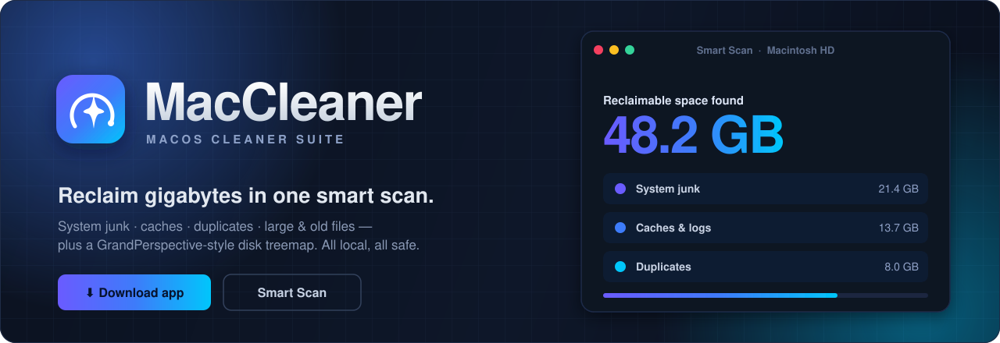

<!-- ░░░░░░░░░░░░░░░░░░░░░░░░░░░  MACCLEANER  ░░░░░░░░░░░░░░░░░░░░░░░░░░░ -->

<div align="center">

<a href="https://github.com/helloworldxdwastaken/MacCleaner/releases">
  
</a>

<br><br>

<!-- primary CTAs -->
<a href="https://github.com/helloworldxdwastaken/MacCleaner/releases"></a>&nbsp;
<a href="https://github.com/helloworldxdwastaken/MacCleaner/stargazers"></a>&nbsp;
<a href="https://github.com/helloworldxdwastaken/MacCleaner/fork"></a>

<br><br>

<!-- platform -->


<br><br>

<kbd><a href="#-download-the-app-for-users">⬇ Download</a></kbd> &nbsp;
<kbd><a href="#-the-suite">✨ Features</a></kbd> &nbsp;
<kbd><a href="#-run-from-source--web-mode-3-commands">🚀 Run it</a></kbd> &nbsp;
<kbd><a href="#-api-overview">🔌 API</a></kbd> &nbsp;
<kbd><a href="#-safety">🛡️ Safety</a></kbd> &nbsp;
<kbd><a href="#-credits">🙏 Credits</a></kbd>

</div>


<br>

<div align="center">
<table>
<tr>
<td align="center" width="33%">🟩&nbsp;&nbsp;<b>Find it</b><br><sub>Smart Scan + a squarified disk treemap</sub></td>
<td align="center" width="33%">🟨&nbsp;&nbsp;<b>Tune it</b><br><sub>Performance, Maintenance & Fan Control</sub></td>
<td align="center" width="33%">🟥&nbsp;&nbsp;<b>Reclaim it</b><br><sub>One-click cleanup → system Trash</sub></td>
</tr>
</table>
</div>

> [!TIP]
> **No setup. No telemetry.** The desktop app is fully self-contained and works on the machine it
> runs on. Deletes always go to your **system Trash** — nothing is ever hard-deleted, so every
> action is recoverable.

<br>

## ✨ The suite

MacCleaner is a full macOS hygiene workbench — cleanup, performance, maintenance, app management, and a
GrandPerspective-style disk treemap — all in one **zero-dependency** frontend.

<div align="center">
  
</div>

<br>

<table>
<tr>
<td width="50%" valign="top">

### 📊 Dashboard
Disk-usage ring, live system stats, file-type breakdown, and the **top-10 largest files _and folders_**. Click a folder to leap straight into the treemap.

</td>
<td width="50%" valign="top">

### ✨ Smart Scan
One pass over caches, logs, and junk with **Smart Suggestions** (`node_modules`, build output, caches, old Downloads, OS junk). Review, then send everything to the Trash in one click.

</td>
</tr>
<tr>
<td width="50%" valign="top">

### ⚡ Performance
Surface memory pressure and heavy processes, manage **login items**, and free up resources so the machine feels quick again.

</td>
<td width="50%" valign="top">

### 🧰 Maintenance
Run common macOS upkeep tasks — flush caches, empty the Bin, and other routine housekeeping — from one place.

</td>
</tr>
<tr>
<td width="50%" valign="top">

### 🗑️ Uninstaller
Remove an app **and its leftovers** — caches, preferences, and support files that a drag-to-Trash uninstall leaves behind.

</td>
<td width="50%" valign="top">

### 🔄 Updater
One-click updates for your installed apps via the **Homebrew cask** catalog, **Sparkle** feeds, and the Mac App Store — no hunting for download pages.

</td>
</tr>
<tr>
<td width="50%" valign="top">

### 🌀 Fan Control *(new)*
Read live fan speeds and temperatures and take manual control of cooling when you want it — new in MacCleaner.

</td>
<td width="50%" valign="top">

### 🗺️ Disk Treemap
A squarified treemap of every file, sized by bytes and colored **teal → amber → red**. Drill into folders, climb back with breadcrumbs + zoom-out, search with highlights (`report`, `*.zip`), and **export PNG / SVG** in one click. *(Originates from [TreeMap](https://github.com/Prithvi-Web/Treemap) — see [Credits](#-credits).)*

</td>
</tr>
<tr>
<td width="50%" valign="top">

### 🔲 Grid · 🧬 Duplicates
A size-proportional icon grid with multi-select and virtual scrolling, plus **true** duplicate detection (size + streamed SHA-256) with reclaimable space per group.

</td>
<td width="50%" valign="top">

### 📈 Trends · 🔀 Compare
Every scan saves a lightweight snapshot charted over time, and any two scans of the same folder can be diffed file-by-file: **added, removed, grew, shrank.**

</td>
</tr>
</table>

> **How it's built** — Node.js + **Express 5** + **TypeScript** on the backend. A single, **zero-dependency** `index.html` on the frontend: hand-coded **Canvas 2D**, no React, no D3, no Chart.js. Ships as a **web app** _and_ a downloadable **Electron desktop app** for macOS and Windows.


## ⬇️ Download the app (for users)

Grab the latest installer from the [**Releases page**](https://github.com/helloworldxdwastaken/MacCleaner/releases):

<table>
<tr><th>Platform</th><th>File</th><th>How</th></tr>
<tr>
<td>🍎 <b>macOS</b></td>
<td><code>MacCleaner-x.y.z-arm64.dmg</code></td>
<td>Open it, drag MacCleaner to Applications, launch.</td>
</tr>
<tr>
<td>🪟 <b>Windows</b></td>
<td><code>MacCleaner Setup x.y.z.exe</code></td>
<td>Run it and follow the installer.</td>
</tr>
</table>

> [!IMPORTANT]
> **First-launch security prompt.** Because the app isn't signed with a paid Apple/Microsoft
> developer certificate, your OS shows a one-time warning.
> - **macOS:** right-click the app → **Open** → **Open**
> - **Windows:** click **More info** → **Run anyway**
>
> After the first launch it opens normally.

<details>
<summary><b>🛠️ macOS says "MacCleaner is damaged and can't be opened"?</b></summary>

<br>

That happens when the download's quarantine flag is still set. Clear it once, then launch normally — open **Terminal** and paste:

```bash
xattr -dr com.apple.quarantine /Applications/MacCleaner.app
```

</details>

> No Node.js or setup required — the desktop app is self-contained and works on the computer it runs on.

### 🖥️ Desktop extras

- 📌 **Menu bar / tray icon** with live free-disk stats and quick actions (open app, scan home folder, quit). Close the window and MacCleaner stays in the tray so scheduled scans keep running — quit from the tray menu.
- 🖱️ **Drag & drop** a folder onto the window or dock icon to scan it instantly.
- 🔄 **Auto-updates** from GitHub Releases (Windows; asks before restarting). On macOS, auto-update needs a code-signed build, so unsigned builds skip it — grab new versions from Releases.
- 🔔 **Growth alerts** from scheduled scans arrive as native notifications.


## 🚀 Run from source / web mode (3 commands)

```bash
npm install
npm run build
npm start
```

Then open **http://127.0.0.1:4280** in your browser.

> 💡 For development with auto-reload: `npm run dev`

Requires **Node.js 20+**. Trash support uses `gio` on Linux (preinstalled on GNOME/KDE), Finder via `osascript` on macOS, and the Recycle Bin via PowerShell on Windows.

### 📦 Build the desktop app

```bash
npm install
npm run app          # build + launch the desktop app locally
npm run dist:mac     # produce a macOS .dmg in release/
npm run dist:win     # produce a Windows installer in release/
```

> ⚠️ You can only build the macOS app on a Mac and the Windows app on Windows.
> To get **both** without owning both machines, use the automated release below — GitHub builds them for you.

<details>
<summary><b>🤖 Publish a new version (automated GitHub Actions)</b></summary>

<br>

A workflow (`.github/workflows/release.yml`) builds the macOS **and** Windows installers on GitHub's servers and attaches them to a Release — including the `latest*.yml` metadata the in-app auto-updater checks.

**To cut a release:**

1. Bump the `version` in `package.json` (e.g. `1.2.1`).
2. Create a matching **tag** prefixed with `v` (e.g. `v1.2.1`) and push it.
   In GitHub Desktop: **Repository → Push**, then on github.com: **Releases → Draft a new release → Choose a tag →** type `v1.2.1` → **Publish**.
3. The workflow runs automatically, builds both installers, and uploads them. After a few minutes the download links appear on the Releases page.

You can also trigger a test build anytime from **Actions → Build & Release → Run workflow** (installers are saved as downloadable artifacts instead of a Release).

</details>


## 🔌 API overview

<details>
<summary><b>Click to expand the full endpoint table</b></summary>

<br>

| Endpoint | Description |
|---|---|
| `POST /api/scan` | Start scanning a folder → `{ scanId }` |
| `GET /api/scan/:id/progress` | Live scan progress (Server-Sent Events) |
| `GET /api/scan/:id/result` | Full file tree (202 while running) |
| `GET /api/scan/:id/treemap` | Pre-computed squarified treemap layout |
| `GET /api/scans` | Completed scans currently in memory |
| `GET /api/large-files?scanId=` | Top N largest files |
| `GET /api/large-folders?scanId=` | Top N largest folders (recursive sizes) |
| `GET /api/file-types?scanId=` | Size breakdown by extension |
| `GET /api/duplicates?scanId=` | Duplicate groups (starts hashing; poll until complete) |
| `GET /api/empty-folders?scanId=` | Recursively empty folders (`ignoreJunk` configurable) |
| `GET /api/compare?scanIdA=&scanIdB=` | File-level diff of two scans of the same root |
| `GET /api/snapshots` | Scan history: roots, per-root snapshots (`?path=`), or all (`?all=true`) |
| `GET /api/snapshots/compare?a=&b=` | Top-level deltas between two snapshots |
| `GET /api/cleanup/suggestions?scanId=` | Smart cleanup suggestions (OS-aware rules) |
| `GET /api/settings` · `PUT /api/settings` | Ignore list + scheduled scans |
| `GET /api/notifications` | Growth alerts from scheduled scans |
| `GET /api/system` | Disk totals, platform, suggested folders |
| `GET /api/fs/list?path=` | Folder browser (powers the path picker) |
| `DELETE /api/files` | Move files to the system trash |
| `POST /api/files/open` | Open / reveal a path in Finder & co. |

</details>


## 🛡️ Safety

Cleaner tools should never lose your data. MacCleaner is built defensively:

- 🔒 Paths are sanitized and traversal-proofed; system dirs (`/proc`, `/sys`, `/dev`, `/run`, `C:\Windows\System32`, …) are blocked outright.
- 🎯 Trash/open endpoints only accept paths **inside a folder you scanned**.
- ♻️ Deletes always go through the OS Trash — undo from Finder/Explorer any time.
- 🧬 The Duplicates view refuses to trash *every* copy in a group — at least one always stays.
- 🚦 Token-bucket rate limiting (10 req/s per IP), plus graceful SIGTERM shutdown that drains live SSE streams and stops background hashing & scheduled scans.
- 🌐 Mostly local: the only outbound requests are the **Updater** fetching the Homebrew cask catalog and app **Sparkle** update feeds to check for new versions — no analytics, no tracking.
- ⏳ Scan results live in memory only and auto-expire after 30 minutes; history snapshots and settings are small JSON files in the platform app-data folder (`~/Library/Application Support/MacCleaner`, `%APPDATA%\MacCleaner`, or `~/.config/maccleaner`).

> **Upgrading from TreeMap?** On first launch MacCleaner moves your existing data from the old
> `TreeMap` app-data folder to the new `MacCleaner` one automatically, so your history and settings
> carry over. Set `MACCLEANER_DATA_DIR` to override the location (the legacy `TREEMAP_DATA_DIR` is
> still honored as a fallback).


## 🗂️ Project layout

```text
src/
  api/          Express routes (scan, files, system, insights, settings,
                cleaner, apps, maintenance, activity)
  services/     DiskScanner (8-way concurrent walker), Cleaner (trash/open),
                DuplicateFinder (staged hashing), Snapshots (Trends history),
                CleanupRules (smart suggestions), Scheduler (recurring scans),
                Apps (uninstall/update), Updater (Homebrew/Sparkle/MAS),
                Settings, Storage (app-data JSON), DiskUsage
  models/       Shared TypeScript interfaces
  utils/        formatBytes, squarified treemap, path sanitizer, glob matcher
  middleware/   errorHandler, rateLimiter, pathGuard
  index.ts      App entrypoint + graceful shutdown
electron/
  main.js       Desktop shell: window, tray, drag-drop, notifications, auto-update
  preload.js    Context-isolated bridge for drag-drop paths & scan pushes
public/
  index.html    The entire frontend (inline CSS + JS, zero dependencies)
scripts/
  gen-tray-icon.js  One-time generator for the tray template icons
```

## 🧠 Design decisions worth knowing

- **Snapshots are automatic** — one is saved after every successful scan, so Trends needs zero setup. Only totals + top-level entry sizes are stored (a few KB each, capped at 200 per folder).
- **The scheduler is a 60-second `setInterval`**, not `node-cron` — hour-level granularity doesn't justify a dependency. Schedules fire while the app runs (the desktop app keeps running in the tray).
- **Duplicate detection is staged** (size → first 64 KB hash → full SHA-256) so scans with hundreds of thousands of files finish hashing in seconds, and only true content matches are reported.
- **Compare collapses subtrees** — a deleted or added folder shows as one row, not thousands of file rows.


## 🙏 Credits

The disk-space treemap visualizer originates from [**TreeMap**](https://github.com/Prithvi-Web/Treemap) by
Prithvi Vinay ([@Prithvi-Web](https://github.com/Prithvi-Web)), used with permission — thank you! MacCleaner
builds a broader macOS cleaner suite around that engine.

<br>


<div align="center">

### Found this useful?

<a href="https://github.com/helloworldxdwastaken/MacCleaner/stargazers"></a>&nbsp;
<a href="https://github.com/helloworldxdwastaken/MacCleaner/fork"></a>&nbsp;
<a href="https://github.com/helloworldxdwastaken/MacCleaner/issues"></a>

<br><br>

**MacCleaner** &nbsp;·&nbsp; built with 🟩🟨🟥 by [**dronx**](https://github.com/helloworldxdwastaken)

<sub>If MacCleaner freed up a few gigs for you, a ⭐ goes a long way.</sub>

</div>
